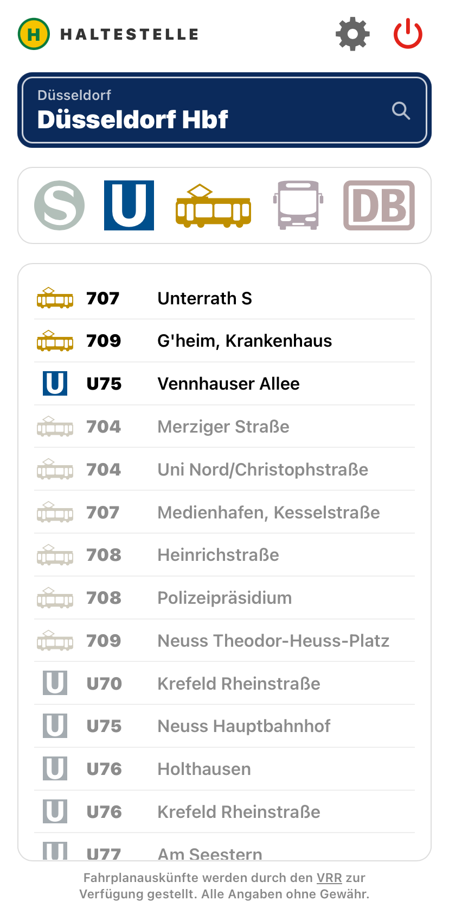
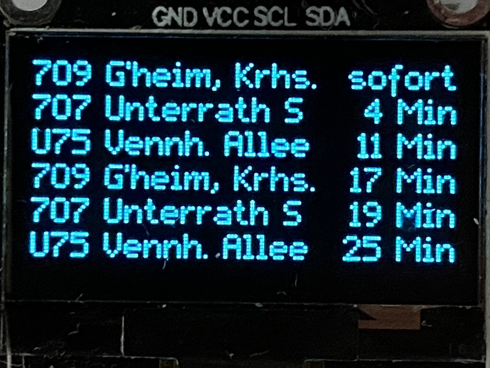
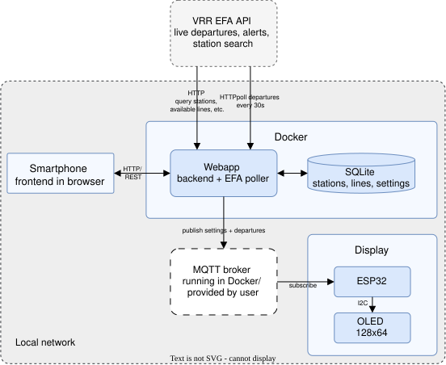
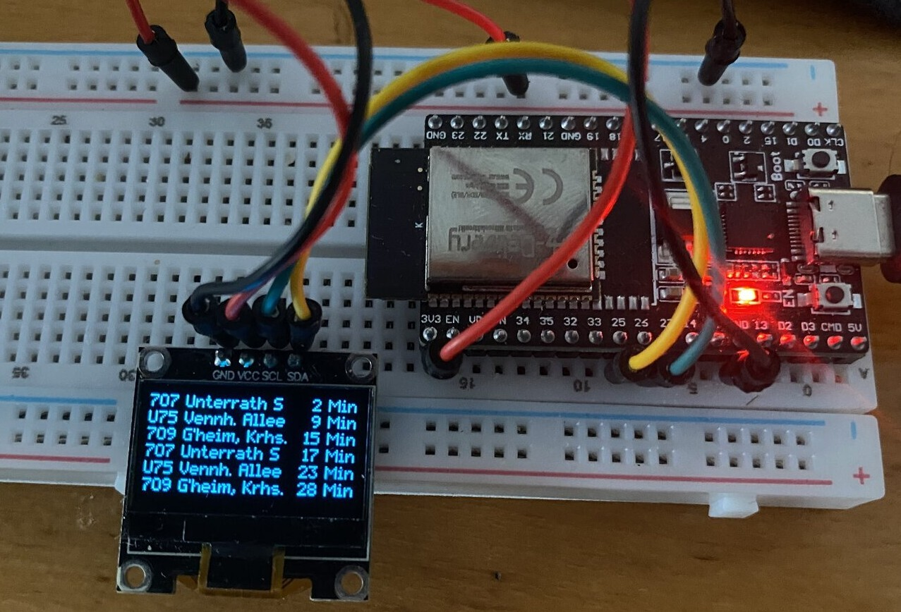

# Haltestelle
A departure monitor for a single public transport stop within VRR (Verkehrsverbund Rhein-Ruhr) and most of NRW (North-Rhine-Westphalia) using the VRR OpenService EFA API (https://www.opendata-oepnv.de/ht/de/api). A web application running in a Docker container picks the stop and lines, and an ESP32 controlling a small OLED display shows the next departures for the selected lines at the selected stop within the next 45 minutes with realtime data, if available. Furthermore, turning the display on or off as well as controlling settings such as the brightness are also supported.

The goal of this project is to create a home departure monitor that resembles most commonly found public departure monitors as closely as possible.

<p align="center">
  
  
</p>
<p align="center"><sub>Web app with selected lines: 707, 709, U75 at Düsseldorf Hbf and the resulting departure board showing the next departures in realtime in minutes.</sub></p>

## Features

- Search any stop in the VRR area. Stops beyond the VRR area across much of NRW also work, but are not guaranteed.
- Filter by vehicle class (e.g. Tram, Bus, etc.) and choose individual lines per direction, per stop.
- Selected stop, lines and settings are remembered across shutdowns.
- The connected display shows live departures with time remaining in minutes. If no realtime data is available, the scheduled departure is shown in hh:mm.
- Disruption notices that affect the chosen lines appear in the web app and scroll along the bottom row of the display.
- Power, brightness, whether notices should be shown and their scroll speed on the display can be set within the web app.

## Architecture

<p align="center">
  
</p>

**Backend** (Python, FastAPI): a REST API to search stops and choose lines. When a stop and optionally specific lines are selected it polls the EFA API every 30 seconds for upcoming departures and publishes the result over MQTT.

**Frontend**: a single HTML file, no build step, made to be rendered on a modern smartphone. It talks to the backend's REST API.

**Database**: a small database that stores everything that should survive a restart, such as selected stop and lines. Furthermore, stops and their available lines with destinations are also stored. When a stop is queried via the backend's REST API only known stops within the database are offered. Alternatively, a stop can be queried by using the EFA API and is then stored in the database. When a stop is first selected, the lines serving it are fetched for the current day and the last Saturday and Sunday, since night lines only run at weekends. The list is refreshed daily at 22:00.

**Broker**: Mosquitto, bundled with the Docker setup. An existing broker can be used instead. With the bundled broker, anyone on the network may subscribe, but only the backend can publish.

**Display firmware** (C, ESP-IDF): joins Wi-Fi, connects to an MQTT broker and subscribes to the topics and renders the board. The I2C driver for the SSD1306, the RGB565 canvas and the bitmap font are written for this project. In a future version it is planned to use a HUB75 RGB LED matrix as an output display. Drawing goes through the canvas, so the same code will carry over.

## MQTT interface

All topics live under a prefix (default `haltestelle`), are published with QoS 1 and are retained, so a client that connects gets the current state right away.

| Topic | Payload |
|---|---|
| `departures` | The board as JSON, every 30s and shortly after a change of stop or selected lines |
| `alerts` | Relevant disruption notices as a JSON list of `{id, version, text}`, `[]` for none |
| `power` | `on` or `off` |
| `settings` | Display settings such as brightness, notice scroll speed, etc. as one JSON object, always complete |
| `status` | `online`, or `offline` on shutdown and as the last will |

`departures`:

```json
{
  "station": "Düsseldorf Hbf",
  "gen": 1791126000,
  "departures": [
    {"line": "709", "cls": 4, "dest": "G'heim, Krankenhaus", "ts": 1791126060,
     "delay": 60, "rt": true, "platform": "3", "sev": false}
  ]
}
```

`gen` is the build time and `ts` the departure time, both epoch seconds; `ts` is realtime if `rt` is true. `cls` is the EFA vehicle class, `delay` is in seconds, and `sev` marks a replacement service.

`settings`:

```json
{"brightness": 80, "alerts": true, "scroll_speed": 25, "language": "en"}
```

`brightness` is 0-100 %, `scroll_speed` is pixels per second, and `language` (`de` or `en`) is stored but not yet applied.

## Setup

### Server

Requires Docker with Compose. Runs on a Raspberry Pi (arm64) as well as on x86.

```bash
git clone https://github.com/Fugi96/haltestelle.git
cd haltestelle
docker compose up -d
```

By default the web app runs on port 8000 and the broker on port 1883. The ports can be changed by copying `.env.example` to `.env` and setting `WEB_APP_PORT` or `BUNDLED_BROKER_PORT`.

If a different MQTT broker shall be used the variables `MQTT_HOST`, `MQTT_PORT`, `MQTT_USERNAME` and `MQTT_PASSWORD` can be set in `.env` and the bundled broker should be disabled by copying `compose.override.example.yaml` to `compose.override.yaml`.

### Display

Hardware required: an ESP32 development board with at least 4 MB of flash and a 128x64 SSD1306 OLED connected on an I2C bus.

Built and tested on an AZ-Delivery ESP32 Dev Kit C V4 (ESP32-D0WD-V3, 4 MB flash).

<p align="center">
  
</p>
<p align="center"><sub>Wiring, display → ESP32: SDA → GPIO 25, SCL → GPIO 26, VCC → 3V3, GND → GND</sub></p>

Build with [ESP-IDF](https://docs.espressif.com/projects/esp-idf/) 6.0:

```bash
cd firmware
idf.py menuconfig   # Set Wi-Fi SSID and password, broker URI, (optionally) change I2C pins
idf.py build flash monitor
```

In menuconfig, set the Wi-Fi SSID and password under "wlink Station Configuration" and the broker URI under "mqtt_svc Configuration". The broker URI is the address of the machine running Docker + port, e.g. `mqtt://raspberrypi.local:1883`. Leave the broker username and password empty for the bundled broker.

The default pins for the I2C bus are: SDA 25, SCL 26. The default address for the OLED is `0x3C`. These can also be changed in the menuconfig under "Display Configuration".

### Development

Requires Python 3.13.

```bash
cd backend
python3 -m venv .venv
./.venv/bin/pip install -r requirements.txt
./.venv/bin/uvicorn app.main:app --reload
```

The web app is then at `http://127.0.0.1:8000`. MQTT settings
for local runs go in `backend/config.toml`, see `backend/config.example.toml`. However, a connection to a running broker is not needed to work on the web app.

## Status

This project is actively being worked on. Most of the core functionality has been implemented.

Planned:

- A 128x64 RGB LED matrix (HUB75) instead of the OLED
- German localization
- OTA update support for the firmware
- Wi-Fi and broker setup on the device instead of at build time

## Data

Departure data: Verkehrsverbund Rhein-Ruhr (VRR), via its open data EFA API. More information: https://www.opendata-oepnv.de/ht/de/api.

By default the backend uses VRR's open test server (https://openservice-test.vrr.de/openservice), which is meant for development and hobby use.
